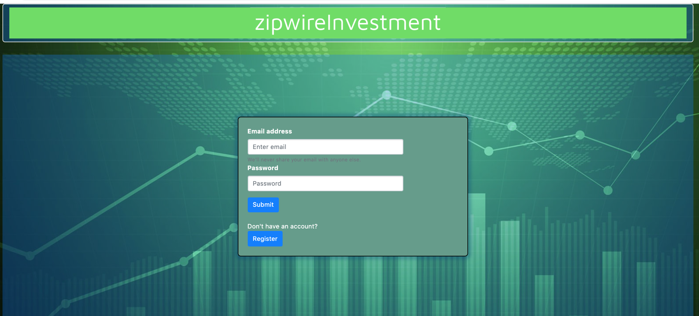

# ZipWire
## Mock Investment Management Micro Web Application - Client 

### Running on your local machine
* Clone the repository
* `npm install` to install dependencies
* `ng serve` - monitor `localhost:4200`
* Requires [ZipWireInvestment-Server](https://github.com/deltaGPhys/ZipWireInvestment-Server), a Spring Boot application

### Screenshots

